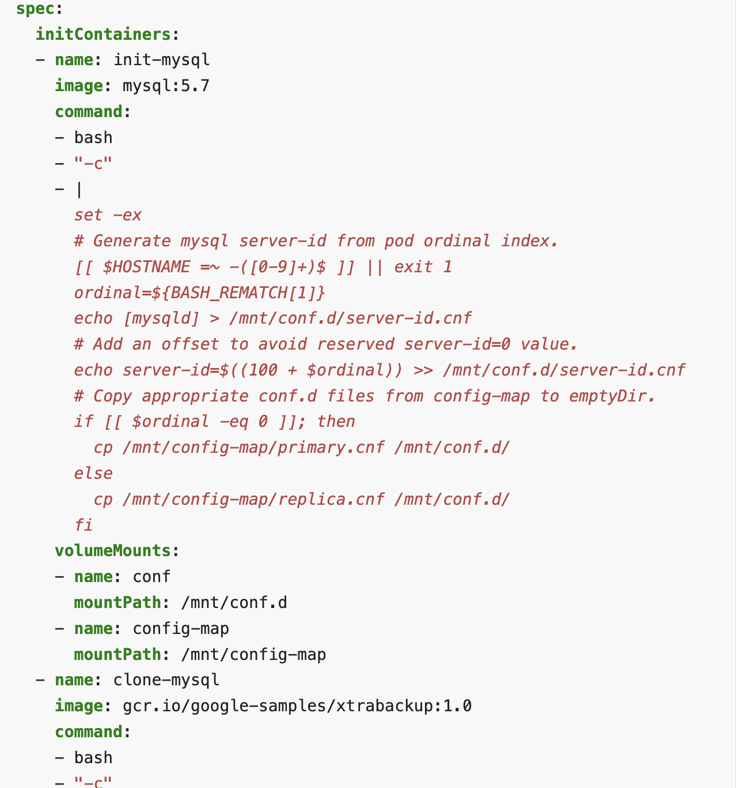
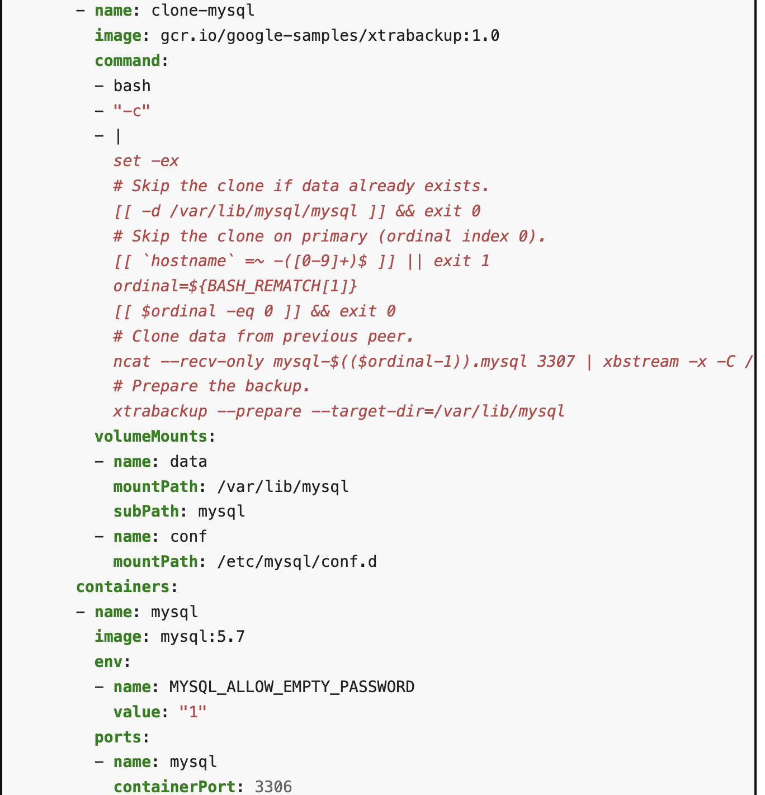
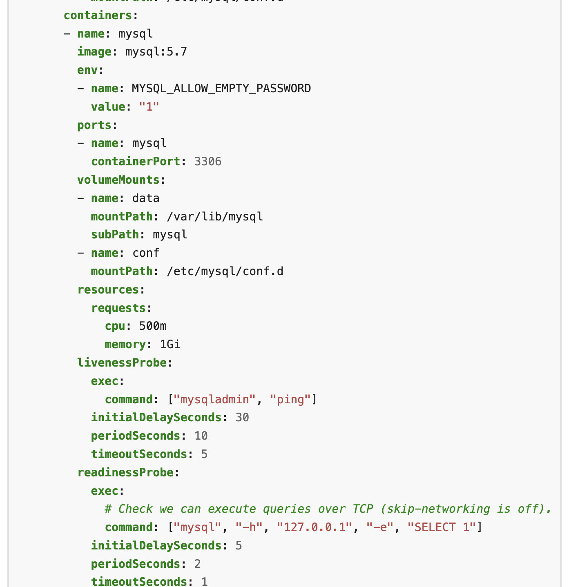
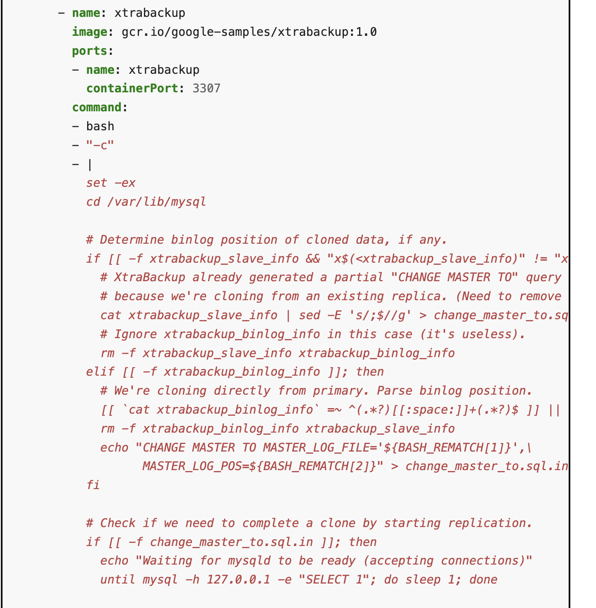

Details

This defines a StatefulSet for deploying a MySQL database cluster in Kubernetes. Here's a brief explanation of its key components:

* **StatefulSet**: 
  This manages the deployment and scaling of a set of pods, with unique identities and stable, persistent storage. It is ideal for stateful applications like databases.
* **Init Containers**:
  * init-mysql: Configures MySQL server instances with unique server IDs and initializes configuration files.
    ***How is this done***

    i. The script generates a unique server-id for each MySQL pod based on its ordinal index, which is crucial for MySQL replication.
    ii. It also determines whether the pod is a primary or replica and copies the appropriate MySQL configuration (primary.cnf for primary, replica.cnf for replicas) from a ConfigMap to the conf.d directory.
    iii. Finally it uses volume mounts to store the generated configuration and to access the MySQL configuration files needed for setting up the server.

    
  * clone-mysql: Clones data from a previous MySQL instance in the StatefulSet if it exists, ensuring data consistency across replicas.
* Containers used :
  * mysql: The **primary** MySQL container, which handles database operations.

    
  * xtrabackup: this **container** is used  for backup and replication between MySQL instances.
    
* Probes:
  * Liveness Probe: Checks if the MySQL process is alive by pinging it.
  * Readiness Probe: Ensures MySQL is ready to accept connections by executing a simple SQL query.
* Volumes:
  * conf: Temporary storage for MySQL configuration files.
  * config-map: Contains the MySQL configuration files (primary.cnf and replica.cnf).
  * data: Persistent storage for MySQL data, backed by a persistent volume claim (PVC).
