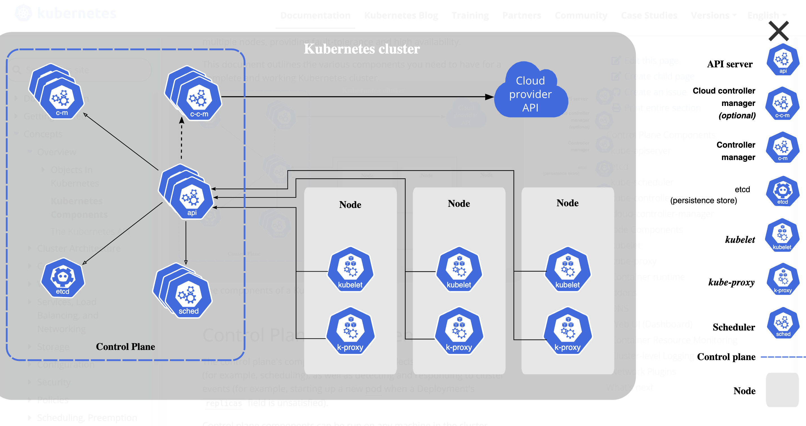
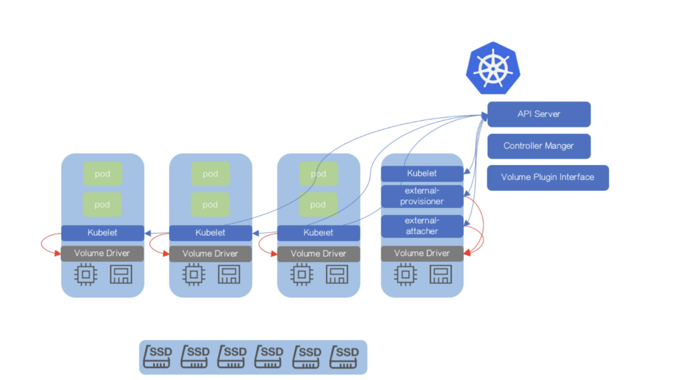

# rodney-syself-devops

### **Production Ready Architecture Design**

#### **1. Infrastructure Layer**

* **Virtual Machines (VMs):**
  * **Control Plane Nodes:** A minimum of one VMs to host the control plane components is deployed. However, a minimum of 3 control nodes, ensures high availability and fault tolerance. These nodes will manage the cluster's state, schedule workloads, and maintain consistency.
  * **Worker Nodes:** Multiple VMs to serve as worker nodes. These nodes will run the containerized applications and handle workloads. The number of worker nodes will depend on the expected load and scalability requirements.
* **Private Network:**
  * **Network Segmentation:** Use a private network to isolate the Kubernetes environment from external traffic, enhancing security. Subnets will be created to separate the control plane and worker nodes, allowing for controlled communication.

#### **2. Operating System Layer**

* **Ubuntu 24.04 LTS:**
  * **Base OS:** All VMs (both control plane and worker nodes) will run Ubuntu 24.04 LTS. This version is chosen for its long-term support, stability, and compatibility with Kubernetes v1.30.3. Regular security updates and patches will be applied to maintain system integrity.

#### **3. Kubernetes Control Plane**

* **Kubernetes Version:** v1.30.3
  * **API Server:** The API server will be deployed on all control plane nodes. It acts as the front-end for the Kubernetes control plane, handling all communication within the cluster.
  * **Etcd:** Etcd acts as a distributed key-value store across all control plane nodes. It stores the cluster's state and configuration, ensuring high availability and data consistency.
  * **Controller Manager:** This component will be responsible for managing the cluster's lifecycle, including node management, replication, and endpoint discovery.
  * **Scheduler:** The scheduler will be deployed on the control plane nodes to assign workloads to the appropriate worker nodes based on resource availability and scheduling policies.

#### **4. Worker Nodes**

* **Kubelet:** Kubelet  is deployed on all worker nodes. It will be responsible for running and managing the containers, ensuring that the desired state defined by the control plane is maintained.
* **Container Runtime:** A container runtime like containerd or CRI-O is used  to manage the lifecycle of containers on the worker nodes. This layer will ensure that containers are launched, monitored, and terminated as needed.
* **Kube-Proxy:** Deploy Kube-Proxy on each worker node to manage network rules and enable communication between services. It ensures seamless networking and load balancing within the cluster.

#### **5. Networking Layer**

* **CNI Plugin:**
  * **Network Plugin:** Install a Container Network Interface (CNI) plugin like Calico or Flannel to manage the networking aspects of the Kubernetes cluster. This plugin will provide features like pod networking, service discovery, and network policies.
  * **Ingress Controller:** Deploy an Ingress controller like NGINX or Traefik to manage external access to the services running in the cluster. This will allow controlled access from outside the private network.

#### **6. Storage Layer**

* **Container Storage Interface (CSI):**
  * **Storage Provisioning:** Implement a CSI-compatible storage solution to manage persistent storage for applications running in the Kubernetes cluster. The CSI will enable dynamic provisioning of storage volumes and ensure that data persists beyond the lifecycle of individual containers.
    *This is how the CSI works as a **volume Driver** and attaches to the node*
    
    More CSi Diagrams
  * **Persistent Volumes (PVs):** Configure Persistent Volumes and Persistent Volume Claims (PVCs) to allocate storage for stateful applications. These volumes will be backed by the storage solution integrated with the CSI.

#### **7. Security Layer**

* **Authentication and Authorization:**
  * **RBAC:** Implement Role-Based Access Control (RBAC) to manage permissions within the cluster. This will ensure that only authorized users and services can perform specific actions. a seperate **VM** can be connected to the cluster for **OIDC** authentication and Auditing of logs.
  * **Network Policies:** Define network policies to control traffic flow between pods and services, enhancing the security posture of the environment.
  * **TLS/SSL Certificates:** Use TLS/SSL certificates to secure communication between components within the Kubernetes cluster.

#### **8. Monitoring and Logging Layer**

* **Monitoring Tools:**
  * **Prometheus:** Deploy Prometheus to monitor the health and performance of the Kubernetes cluster. It will collect metrics from the control plane and worker nodes, providing insights into resource utilization and potential issues.
  * **Grafana:** Use Grafana for visualizing the metrics collected by Prometheus, enabling better decision-making and troubleshooting.
* **Logging:**
  * **ELK Stack:** Implement the ELK (Elasticsearch, Logstash, Kibana) stack or a similar logging solution to aggregate and analyze logs generated by the Kubernetes components and applications. This will help in identifying issues and maintaining audit trails.

#### **9. High Availability and Scalability**

* **Load Balancer:**
  * **External Load Balancer:** Deploy an external load balancer to distribute traffic across the control plane nodes, ensuring high availability and preventing a single point of failure.
* **Auto-Scaling:**
  * **Horizontal Pod Autoscaler (HPA):** Implement HPA to automatically scale the number of pods based on resource utilization, ensuring the cluster can handle varying workloads.
  * **Cluster Autoscaler:** Use a cluster autoscaler to automatically adjust the number of worker nodes in response to workload demands, optimizing resource usage and cost.

#### **10. Backup and Disaster Recovery**

* **Backup Strategy:**
  * **Etcd Backup:** Regularly back up the Etcd data to ensure that the cluster state can be restored in case of a failure.
  * **Persistent Volume Backups:** Implement a backup solution for persistent volumes to protect against data loss.
